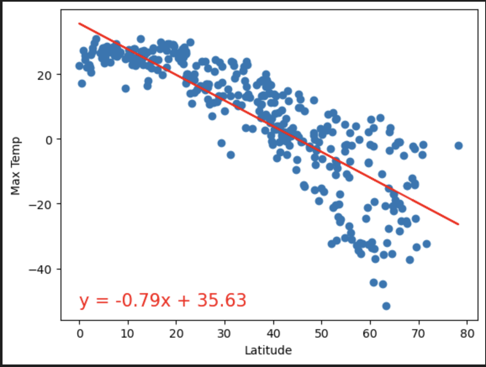
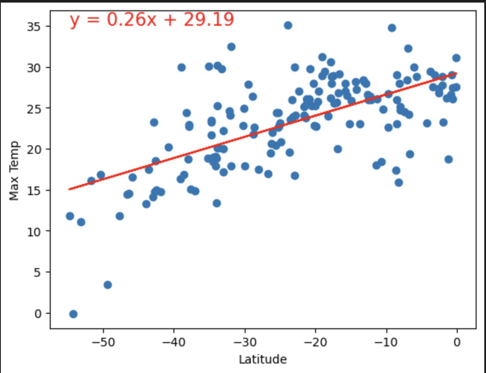
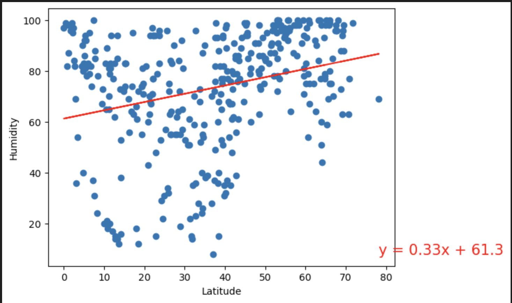
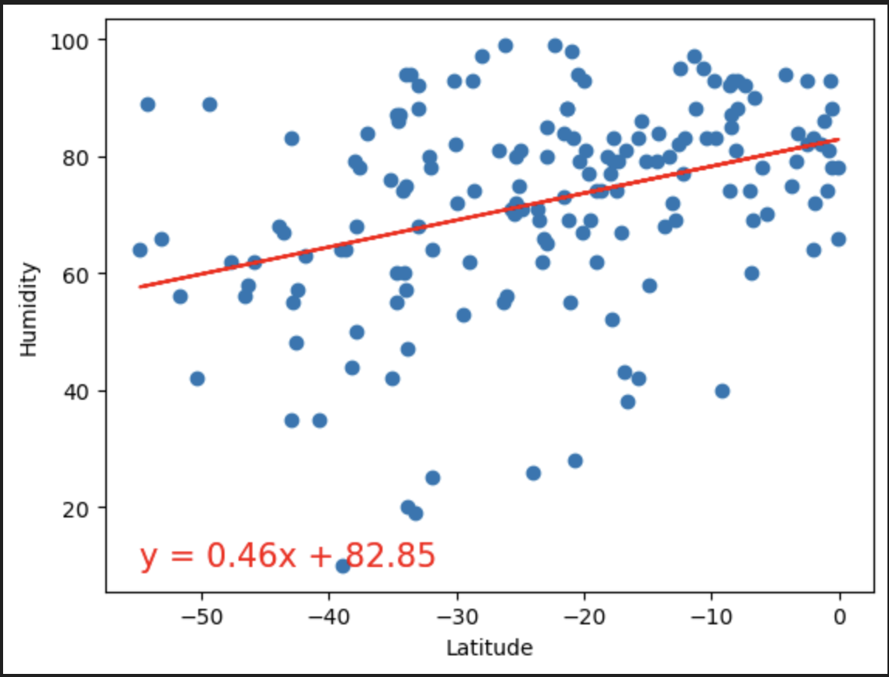
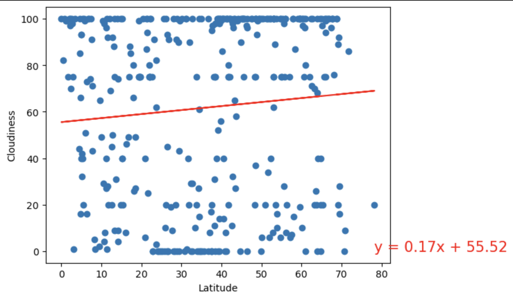
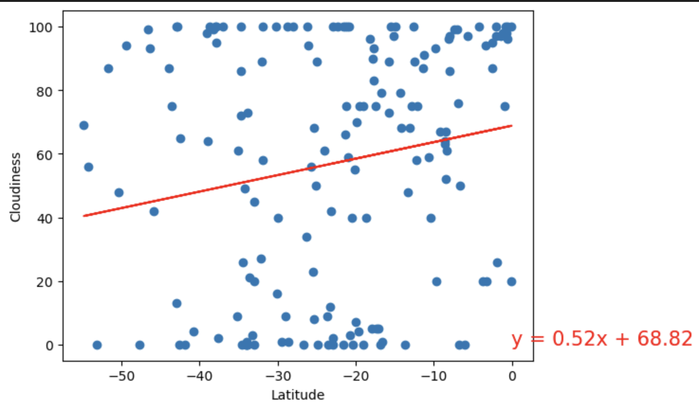
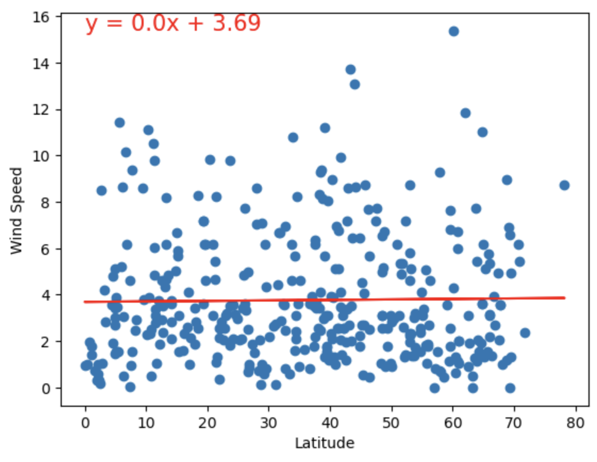
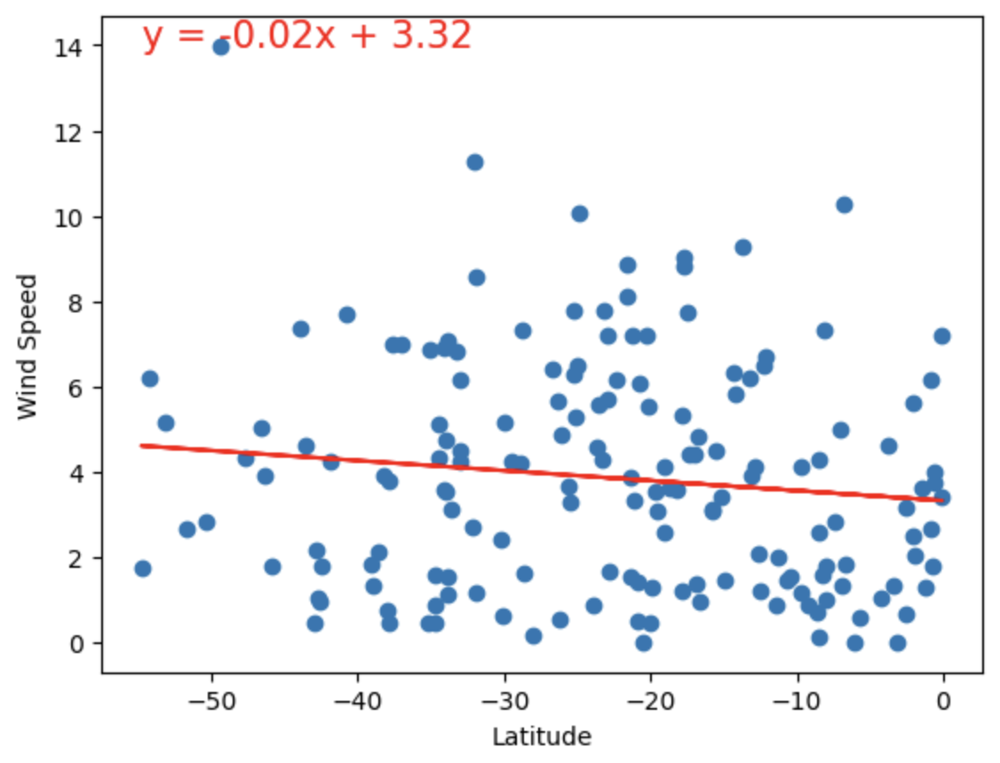

# python-api-challenge
Python API Challenge related files are in the repository

## Solution
There is one folder called WeatherAnalysis, in which you will find two more files WeatherPy.ipynb and VacationPy.ipynb which contains the code. You will also see the output for cities.csv.

## Analysis
### Temperature vs. Latitude Linear Regression Plot - Northern vs Southern Hemisphere

Northern Hemisphere: 
- The negative slope of -0.79 suggests a negative correlation which indicates the latitude and the maximum temperature. As the latitude increases, the temperature is decreasing. The intercept for Northern Hemisphere is 35.63 which suggests that this is the estimated max temperature when latitude is at the equator. The R-value was 0.721714 which shows a relatively strong positive correlation.  

Souhern Hemisphere: 
- The positive slope of 0.26 suggests a positive correlation which indicates the latitude and the maximum temperature. As the latitude increases, the temperature is also increasing. The intercept for Southern Hemisphere is 29.19 which suggests that this is the estimated max temperature when latitude is at the equator. The R-value was 0.409019 which shows a weak positive correlation.  

### Humidity vs. Latitude Linear Regression Plot - Northern vs Southern Hemisphere
Based on the linear regression plot for both Northern and Southern Hemisphere, we can see that both hemispheres show a weak positive correlation between latitude and humidity. Both plots show, positive slope which suggests that as latitude increase, humidity tends to increase also. 

### Cloudiness vs. Latitude Linear Regression Plot - Northern vs Southern Hemisphere
Based on the linear regression plot for both Northern and Southern Hemisphere, we can see that both hemispheres show a weak positive correlation between cloudiness and latitude. Both plots show, positive slope which suggests that as latitude increase, cloudiness tends to increase also. 

### Wind Speed vs. Latitude Linear Regression Plot - Northern vs Southern Hemisphere
Based on the linear regression plot for both Northern and Southern Hemisphere, we can see that both hemispheres show a weak correlation between wind speed and latitude. 

For Northern Hemisphere, the slope was 0.0 which suggests a very weak positive correlation between wind speed and latitude, however the R-value was 0.0002339 which indicates a very weak correlation. It is almost like there is no apparant relationship between wind speed and latitude. 

For Southern Hemisphere, the slope was -0.02 which suggests a negative correlation between wind speed and latitude, however the R-value was 0.014501 which indicates a weak positive correlation. The R-Value suggests that there is a small tendency for the wind speed to decrease as you move closer to the equator. 

## Screenshots
I have uploaded the screenshots for the output for all the scatter plots and linear regression plots for WeatherPY and I have included two screenshots from VactionPY for the map. 

### Scatterplot: Latitude vs. Temperature

### Scatterplot: Latitude vs. Humidity

### Scatterplot: Latitude vs. Cloudiness

### Scatterplot: Latitude vs. Wind Speed

### Temperature vs. Latitude Linear Regression Plot

#### Northern Hemisphere

#### Southern Hemisphere

### Humidity vs. Latitude Linear Regression Plot

#### Northern Hemisphere

#### Southern Hemisphere

### Cloudiness vs. Latitude Linear Regression Plot

#### Northern Hemisphere

#### Southern Hemisphere

### Wind Speed vs. Latitude Linear Regression Plot

#### Northern Hemisphere

#### Southern Hemisphere

