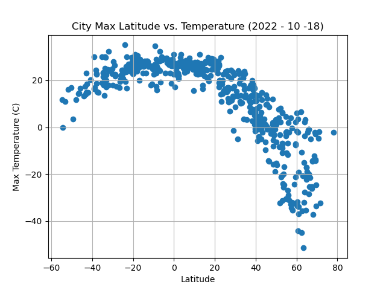
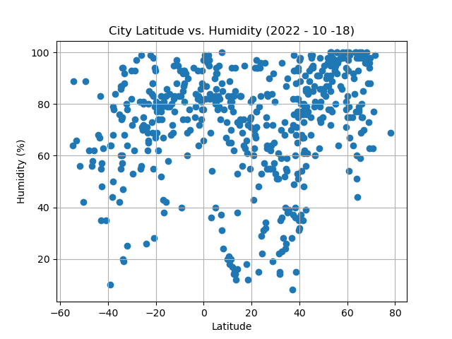
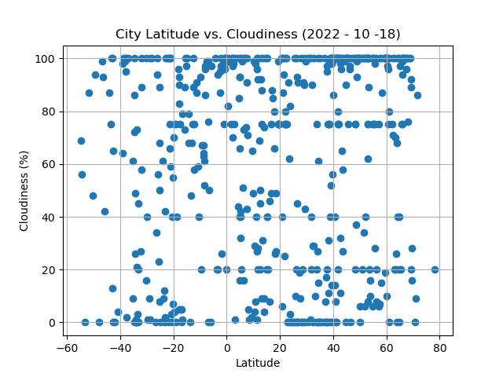
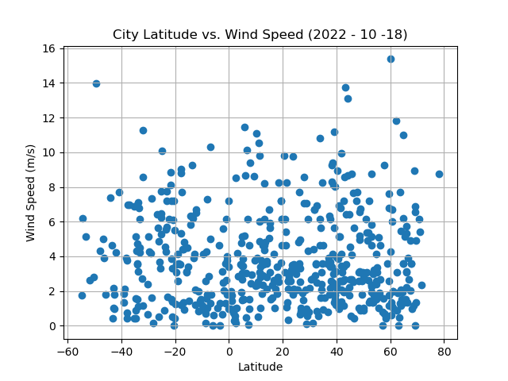

# python-api-challenge
Python API Challenge related files are in the repository

## Solution
There is one folder called WeatherAnalysis, in which you will find two more files WeatherPy.ipynb and VacationPy.ipynb which contains the code. You will also see the output for cities.csv.

## Screenshots
I have uploaded the screenshots for the output for all the scatter plots and linear regression plots for WeatherPY and I have included two screenshots from VactionPY for the map. 

Scatterplot: Latitude vs. Temperature

Scatterplot: Latitude vs. Humidity

Scatterplot: Latitude vs. Cloudiness

Scatterplot: Latitude vs. Wind Speed

